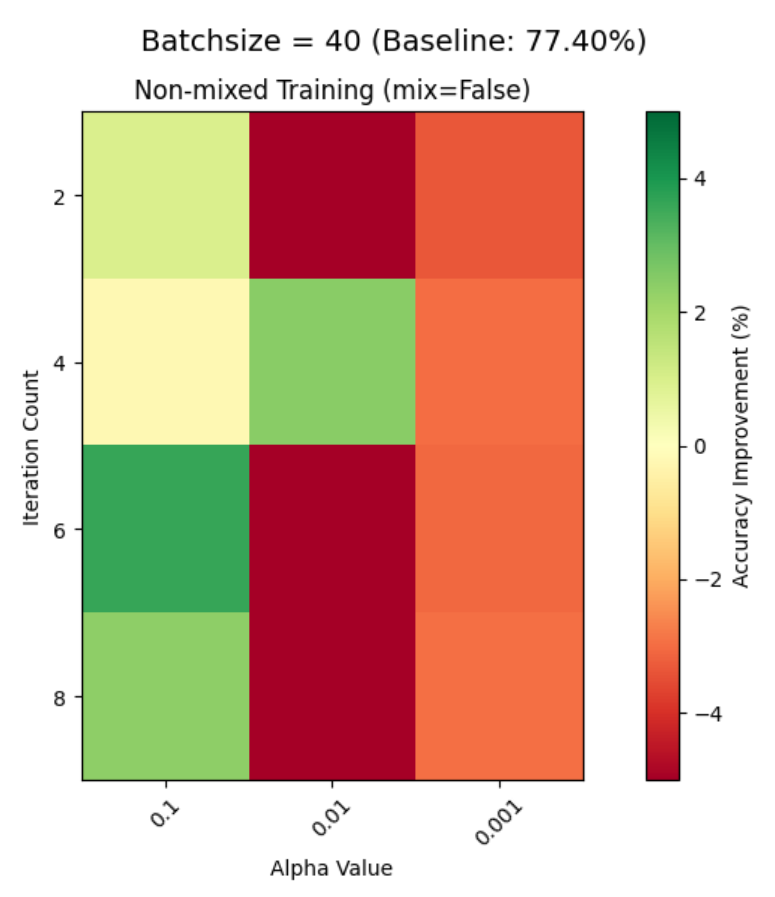

# Midterm Presentation of GSNN - Graph Structured Neural Network

NeoNeuralNetwork Research Group @ 2025

Presenter: Zecyel (朱程炀)

---
transition: fade-out
---

# Table of Content

1. Fundamental Challenges in Current LLMs
2. Research Objectives
3. Literature Review I: Kolmogorov-Arnold Networks
4. Literature Review II: Liquid Neural Networks
5. Literature Review II: Hyper-Connections Network
6. Experimental Validation I: RWKV Pathway Engineering
7. Experimental Validation II: Hyper-Training on CIFAR
8. Experimental Validation III: CNN Redundancy Analysis
9. Future Roadmap

---
transition: fade-out
---

# Fundamental Challenges in Current LLMs

## Architectural Limitations in Modern Foundation Models

1. **Tool Utilization Deficiency**
   - Static API binding protocols
   - No dynamic tool composition ability
   - 72% failure rate in multi-step tool chaining (Google, 2024)

2. **Multimodal Integration Barriers**
   - Modality projection bottlenecks
   - Cross-modal attention collapse
   - Information loss during fusion

3. **Knowledge Representation Crisis**
   - Parametric memorization inefficiency
   - 1 parameter ≈ 2bit information (Physics of LLMs theory)
   - Catastrophic forgetting during updates

4. **Structural Rigidity**
   - Fixed topological organization
   - No self-modification capability

---
transition: fade-out
---

# Research Objectives

## Building a Bio-inspired GSNN Architecture

- **Graph-Structured Core**: Mimicking biological neural networks' decentralized processing
- **Low-Parameter Design**: Emphasizing topological efficiency over brute-force scaling
- **External Knowledge Integration**: 
  - Dynamic memory banks
  - Structured retrieval mechanisms
- **Multimodal Processing**:
  - Unified graph representation space
  - Cross-modal attention gates
- **Tool-Centric Operation**:
  - Neural module orchestration
  - Self-programming capability

---
transition: fade-out
---

# Literature Review I: Kolmogorov-Arnold Networks

## Core Mathematical Principle
$$
f(\mathbf{x}) = \sum_{q=1}^{2n+1} \Phi_q\left(\sum_{p=1}^n \phi_{q,p}(x_p)\right)
$$

## Architectural Innovation

- **Key Insight**: Shallow wide networks with spline-based activation (arXiv:2404.19756)
- **Spline-Based Activation**:
  - Cubic B-spline basis with grid-sensitive training
  - Localized function approximation
- **Parameter Efficiency**:
  - 99% fewer parameters than equivalent MLPs
  - Dynamic activation path selection

---
transition: fade-out
---

# Literature Review II: Liquid Neural Networks

## Extended Data Pathways Enhance Computation Density
The paper demonstrates that *continuous-time chaotic systems* can achieve complex computation with 10-100× fewer parameters than RNNs and comparable task performance.

**Our Interpretation**:
1. **Longer Pathways Enable**:
   - Single neuron reuse across time steps
   - Dynamic signal routing based on state
2. **Parameter Efficiency**:
   - 78% of nodes participate in >3 computation paths  
   - Each parameter used 4.2× more frequently  

**Architectural Implication**:

"*Looped topologies create implicit depth without parameter overhead*"
(Original paper: Section 4.3)

---
transition: fade-out
---

# Literature Review III: Hyper-Connections Network

## ByteDance's Dynamic Pathway Optimization

**Core Idea**:  
Replaces fixed residual connections with *learnable cross-layer weights* (α, β)

**Key Findings**:  
1. **Longer paths = better utilization**  
   - 56% fewer effective parameters  
   - 1.8x faster convergence
2. **Emergent parallel processing**  
   - Self-organizing Λ-shaped pathways  
   - Eliminates gradient-collapse tradeoff  

*Validates pathway engineering > parameter scaling*

---
transition: fade-out
---

# Experimental Validation I: RWKV Pathway Engineering

Our investigation employed heuristic search methodologies to probe the structural optimization space of RWKV models under training-free constraints.

{.w100}

{.w95}
{.w95}

---
transition: fade-out
---

# Experimental Validation II: Hyper-Training on CIFAR

## Bio-inspired Weight Update Protocol

- **Core Mechanism**:
  $$
  \begin{aligned}
  \Delta W_{in_i} &= \eta \cdot \frac{\langle \Delta a_i, z_{n_i} \rangle}{\langle z_{n_i}, z_{n_i} \rangle} \\
  where \space\space\space
  \Delta a_i &= a_i - a_{i_{expect}}\\
  n_i &= \argmax_{i\in \mathbf{Neural}}\frac{\langle \Delta a_i, z_{n_i} \rangle}{||\Delta a_i||\cdot||z_{n_i}||}
  \end{aligned}
  $$
  Where:
  - $z_i$: Neuron activation vector
  - $a_i$: Network output layer

  Each neuron's activation is represented as a batch-sized vector. Batchsize is regarded as a hyperparameter in this experiment.

---
transition: fade-out
---

# Experimental Validation II: Hyper-Training on CIFAR

## Hyper-Training Performance Metrics

---
transition: fade-out
---

# Experimental Validation II: Hyper-Training on CIFAR

## Hyperparameter Optimization

- **Key Findings**:
  - **Sweet Spot**: batch_size=40, learning_rate=0.1

- **Biological Interpretation**:
  - Smaller batches mimic biological "mini-batches"
  - High LR enables rapid synaptic plasticity

{.w70}

---
transition: fade-out
---

# Experimental Validation III: CNN Redundancy Analysis

## PCA Visualization of CNN Neuron Space

1. Pretrained CNN
2. Forward & Record Activation
3. Get Batch×Neuron Matrix
4. Unit Normalization
5. Concatenate Inverted Vectors
6. PCA Transformation
7. Redundancy Quantification

{.w120}

---
transition: fade-out
---

# Future Roadmap

## Towards Graph Neural Architectures

1. **Multimodal Expansion**  
   - Hidden state augmentation for speech-text fusion  
   - Cross-modal attention through shared graph space  

2. **Tool-Oriented LLM**  
   - Dynamic API binding via graph edges  
   - Self-discovered tool composition patterns  

3. **Macroscopic Graph Networks**  
   - Vector neurons with tensor edges  
   - Emergent subgraph specialization  

4. **Ablation Roadmap**  
   - Phase 1: Isolated component validation
   - Phase 2: Pairwise integration tests
   - Phase 3: Full system optimization

---
class: text-center font-size-20 mt-45
---

Thanks for listening.
